<h1>Taller 10 - Ángel Leonardo Florez Luna</h1>

<h2>Información</h2>

Curso: Full Stack Basico - Grupo 1

Profesor: Cristian Felipe Patiño Cáceres

<h2>Punto 1: Constantes y variables</h2>

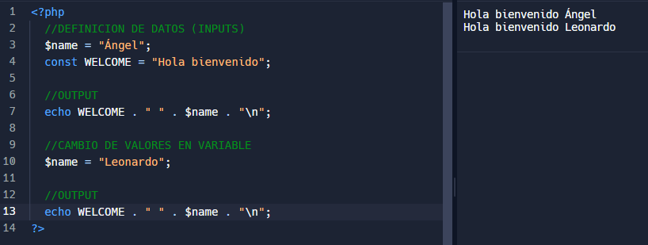

<h2>Punto 2: Suma de constantes y variables</h2>

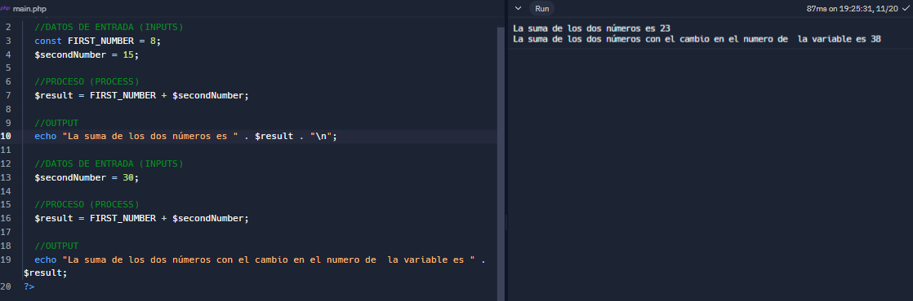

<h2>Punto 3: Suma de dos numeros indicados por el usuario</h2>

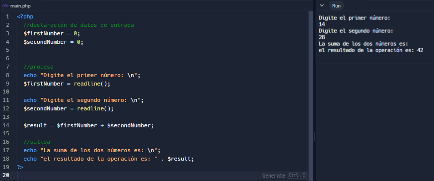

<h2>Punto 4: Datos del usuario en consola</h2>

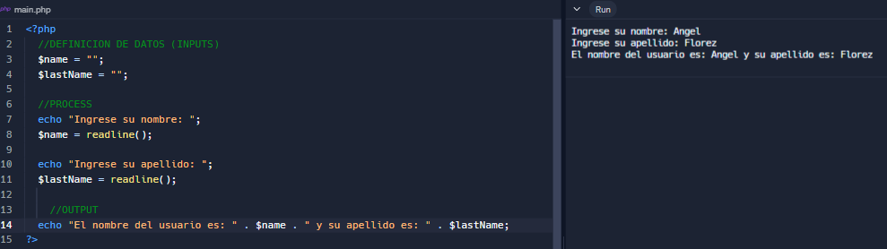

<h2>Punto 5: Entrada de bolera usando if / else</h2>

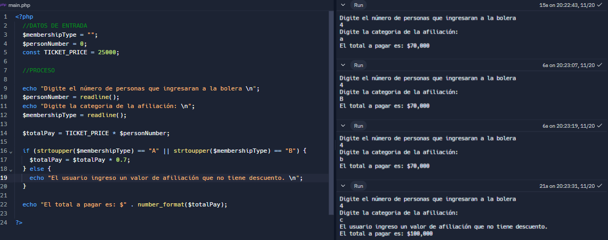

<h2>Punto 6: Deteccion mayoria de edad</h2>

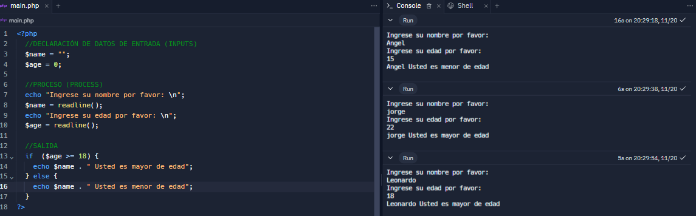

<h2>Punto 7: Seleccion de operación aritemtica</h2>

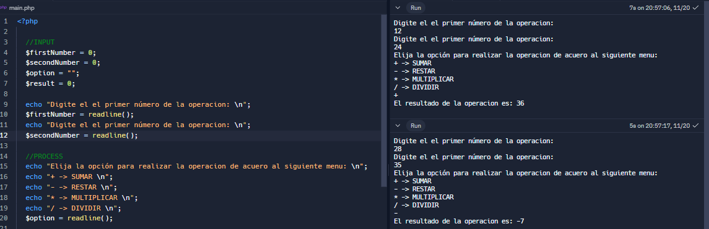
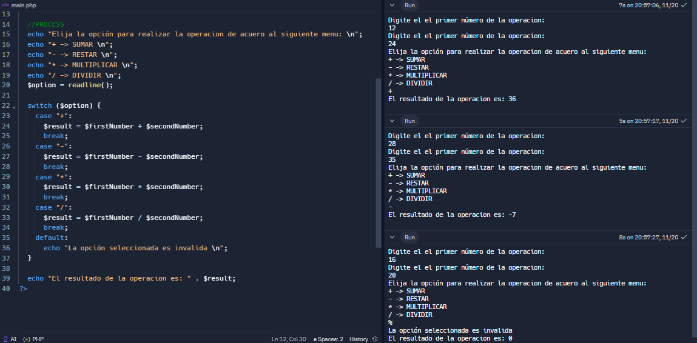

<h2>Punto 8: Entrada de bolera usando switch</h2>

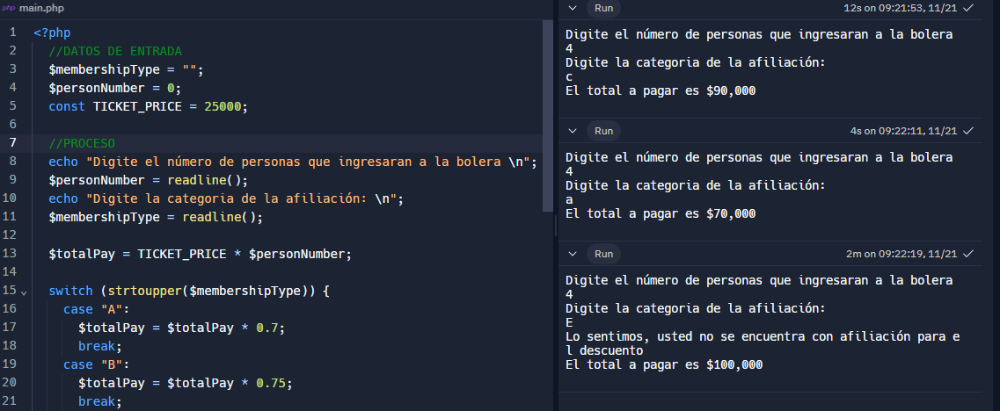
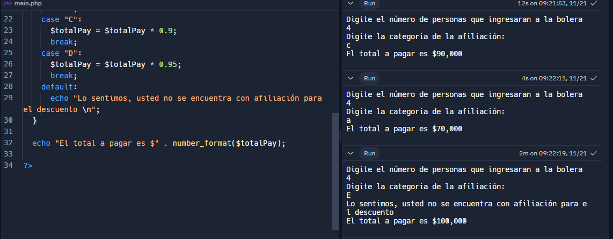

<h2>Punto 9: Tabla de multiplicar usando while</h2>

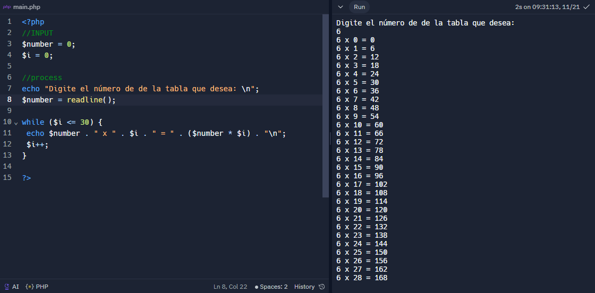

<h2>Punto 10: Numeros pares usando while</h2>

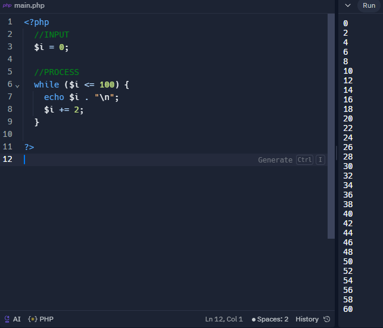

<h2>Punto 11: Numero impares usando for</h2>

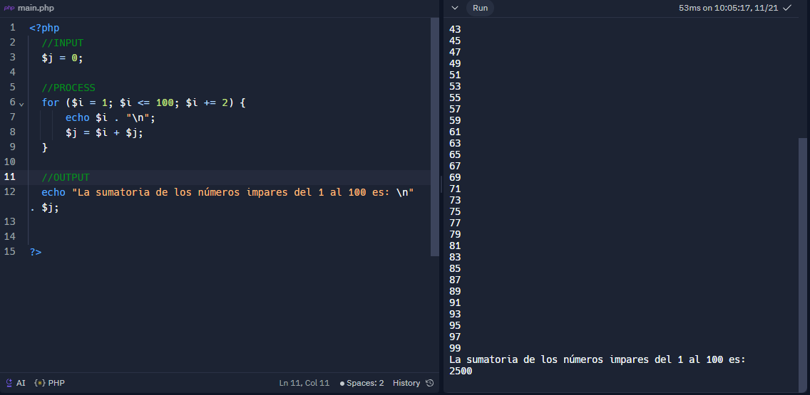

<h2>Punto 12: Tabla de multiplicar usando for</h2>

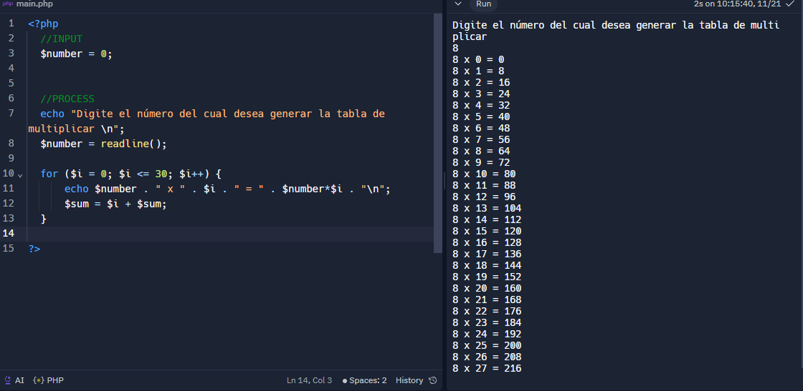

<h2>Punto 13: Suma de valores de un arreglo usando foreach</h2>

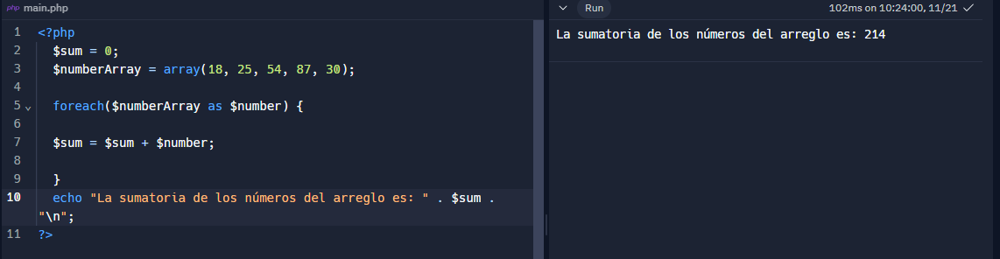

<h2>Punto 14: Revision de contraseña</h2>

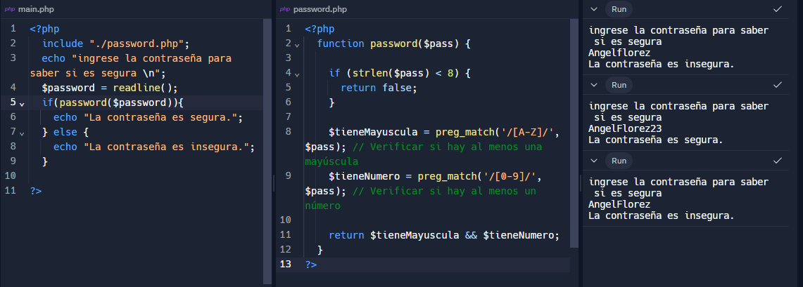

<h2>Punto 15: Seleccion de operación aritmetica usando funciones</h2>

